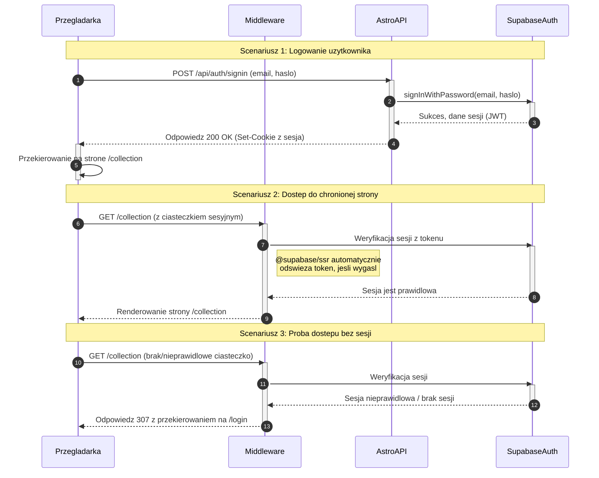

<authentication_analysis>
1.  **Przepływy autentykacji:**
    *   **Logowanie użytkownika:** Jedyny aktywny przepływ. Użytkownik podaje e-mail i hasło na stronie `/login`. Dane są wysyłane do dedykowanego endpointu API (`/api/auth/signin`), który weryfikuje je za pomocą Supabase Auth. Nie ma publicznej rejestracji ani odzyskiwania hasła.
    *   **Weryfikacja sesji na chronionych stronach:** Przy każdej próbie dostępu do chronionej strony (np. `/collection`), middleware sprawdza ważność sesji użytkownika.
    *   **Wylogowanie:** Użytkownik inicjuje proces wylogowania, co unieważnia sesję i usuwa odpowiednie ciasteczka.

2.  **Główni aktorzy i ich interakcje:**
    *   **Przeglądarka (Browser):** Renderuje interfejs (formularz logowania), wysyła dane uwierzytelniające do API, przechowuje ciasteczka sesyjne i wysyła żądania dostępu do stron.
    *   **Middleware (Astro):** Przechwytuje wszystkie żądania do serwera. Tworzy instancję klienta Supabase i weryfikuje sesję na podstawie ciasteczek. Jeśli sesja jest ważna, udostępnia ją w kontekście żądania. W przeciwnym razie może przekierować użytkownika na stronę logowania.
    *   **Astro API:** Odbiera dane logowania od przeglądarki. Komunikuje się z Supabase Auth w celu weryfikacji poświadczeń (`signInWithPassword`) lub wylogowania (`signOut`).
    *   **Supabase Auth:** Usługa odpowiedzialna za walidację poświadczeń, tworzenie i zarządzanie sesjami (tokeny JWT) oraz ich unieważnianie.

3.  **Procesy weryfikacji i odświeżania tokenów:**
    *   Proces ten jest w dużej mierze zarządzany automatycznie przez bibliotekę `@supabase/ssr`.
    *   **Weryfikacja:** Przy każdym żądaniu do chronionej trasy, middleware używa klienta Supabase do zweryfikowania tokenu dostępowego (access token) z ciasteczek.
    *   **Odświeżanie:** Jeśli token dostępowy wygasł, `@supabase/ssr` automatycznie używa tokenu odświeżającego (refresh token), również przechowywanego w ciasteczkach, aby w tle uzyskać nową parę tokenów od Supabase Auth. Ten proces jest transparentny dla użytkownika i aplikacji.

4.  **Opis kroków autentykacji:**
    *   **Logowanie:** Użytkownik wypełnia formularz -> Przeglądarka wysyła POST do `/api/auth/signin` -> Astro API wywołuje `signInWithPassword` w Supabase -> Supabase Auth weryfikuje dane -> Jeśli poprawne, Supabase Auth generuje tokeny -> Astro API, używając `@supabase/ssr`, ustawia tokeny w bezpiecznych ciasteczkach `httpOnly` w odpowiedzi dla przeglądarki -> Przeglądarka przekierowuje użytkownika.
    *   **Dostęp do chronionej strony:** Użytkownik klika link do `/collection` -> Przeglądarka wysyła żądanie GET z ciasteczkami sesyjnymi -> Middleware przechwytuje żądanie -> Middleware używa `@supabase/ssr` do walidacji tokenów z Supabase Auth -> Jeśli sesja jest ważna, żądanie jest przekazywane dalej i strona jest renderowana. Jeśli nie, middleware przekierowuje do `/login`.
</authentication_analysis>

<mermaid_diagram>

</mermaid_diagram>
