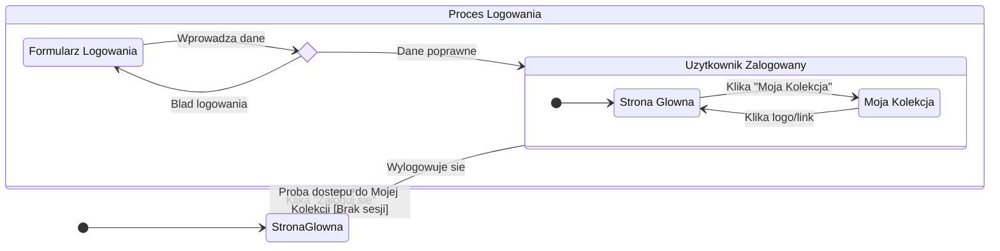

<user_journey_analysis>
1.  **Ścieżki użytkownika:**
    *   **Gość (użytkownik niezalogowany):** Może przeglądać stronę główną. Próba dostępu do chronionej sekcji "Moja Kolekcja" skutkuje przekierowaniem na stronę logowania.
    *   **Logowanie:** Użytkownik jest na stronie logowania, wprowadza dane. System weryfikuje dane. W przypadku sukcesu użytkownik przechodzi do stanu "zalogowany". W przypadku porażki pozostaje na stronie logowania z komunikatem o błędzie.
    *   **Użytkownik zalogowany:** Może swobodnie poruszać się między stroną główną a swoją kolekcją. Może zarządzać kolekcją (dodawać/usuwać perfumy). Może się wylogować.

2.  **Główne podróże i stany:**
    *   **Stan początkowy:** Użytkownik wchodzi na stronę, jest gościem.
    *   **Przeglądanie jako gość:** Stan, w którym użytkownik znajduje się na `Stronie Głównej`.
    *   **Proces logowania:** Stan złożony, obejmujący `Stronę Logowania` i weryfikację poświadczeń.
    *   **Korzystanie z aplikacji jako zalogowany użytkownik:** Stan złożony (`Zalogowany`), w którym użytkownik może być na `Stronie Głównej` lub na stronie `Moja Kolekcja`.
    *   **Wylogowanie:** Akcja prowadząca ze stanu `Zalogowany` do stanu `Gość` na `Stronie Głównej`.

3.  **Punkty decyzyjne:**
    *   **Próba dostępu do kolekcji:** System sprawdza, czy użytkownik jest zalogowany. Jeśli nie, kieruje na `/login`. Jeśli tak, wyświetla `/collection`.
    *   **Walidacja formularza logowania:** System sprawdza poprawność e-maila i hasła. Sukces prowadzi do aplikacji, porażka wyświetla błąd.

4.  **Opis celu każdego stanu:**
    *   **`[*] (Start)`:** Wejście do aplikacji.
    *   **`StronaGlowna`:** Główny punkt wejścia, dostępny dla wszystkich. Prezentuje aplikację.
    *   **`StronaLogowania`:** Miejsce, gdzie użytkownik może się uwierzytelnić, aby uzyskać dostęp do prywatnych zasobów.
    *   **`if_logowanie <<choice>>`:** Logiczny punkt decyzyjny po przesłaniu formularza logowania.
    *   **`Zalogowany`:** Stan nadrzędny oznaczający, że użytkownik ma aktywną sesję.
    *   **`MojaKolekcja`:** Prywatna, chroniona strona, gdzie użytkownik zarządza swoją kolekcją perfum.
</user_journey_analysis>

<mermaid_diagram>

</mermaid_diagram>
