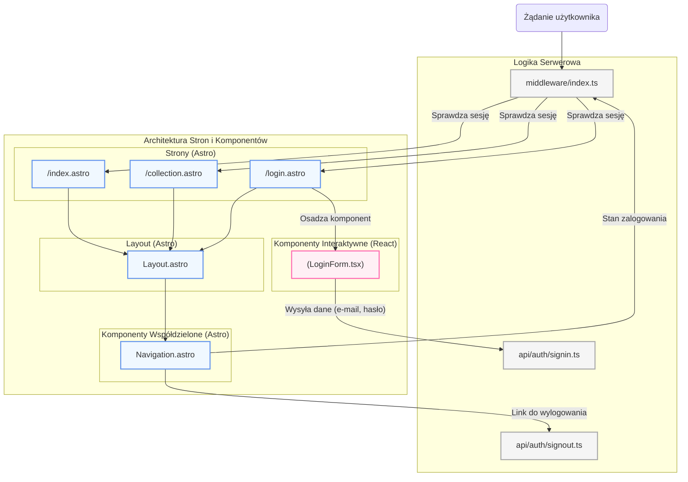

<architecture_analysis>
1.  **Lista komponentów:**
    *   **Strony Astro:** `index.astro` (Strona Główna), `collection.astro` (Moja Kolekcja - chroniona), `login.astro` (Strona Logowania).
    *   **Layout Astro:** `Layout.astro` (główny szablon).
    *   **Komponenty Astro (współdzielone):** `Navigation.astro`.
    *   **Komponenty React (interaktywne):** `LoginForm.tsx`.
    *   **Logika serwerowa (wpływająca na UI):** `middleware/index.ts`, `api/auth/signin.ts`, `api/auth/signout.ts`.

2.  **Główne strony i ich komponenty:**
    *   **`index.astro`:** Używa `Layout.astro` i `Navigation.astro`. Wyświetla publiczną zawartość.
    *   **`collection.astro`:** Używa `Layout.astro` i `Navigation.astro`. Dostęp do niej jest chroniony przez `middleware`.
    *   **`login.astro`:** Używa `Layout.astro` i `Navigation.astro`. Osadza w sobie interaktywny komponent `LoginForm.tsx`.

3.  **Przepływ danych:**
    *   Głównym "danym" wpływającym na UI jest stan sesji (`Astro.locals.session`), ustalany przez `middleware`.
    *   Stan sesji jest odczytywany przez strony Astro (`index.astro`, `collection.astro`, `login.astro`).
    *   Strony przekazują informację o stanie zalogowania (lub komponenty same ją odczytują) do `Navigation.astro`, który warunkowo renderuje przycisk "Zaloguj się" lub "Wyloguj się".
    *   Komponent `LoginForm.tsx` zbiera dane od użytkownika (e-mail, hasło) i wysyła je do endpointu `api/auth/signin.ts` w celu weryfikacji.

4.  **Opis funkcjonalności komponentów:**
    *   **`middleware/index.ts`:** Działa na serwerze przed renderowaniem strony. Sprawdza ciasteczka, weryfikuje sesję i udostępnia `Astro.locals.session`. Przekierowuje niezalogowanych użytkowników próbujących dostać się do `/collection`.
    *   **`Layout.astro`:** Definiuje wspólną strukturę HTML dla wszystkich stron.
    *   **`Navigation.astro`:** Komponent współdzielony, wyświetlany na każdej stronie. Jego wygląd i akcje zależą od stanu zalogowania użytkownika.
    *   **`login.astro`:** Strona-kontener dla formularza logowania. Renderuje statyczną otoczkę i osadza komponent React.
    *   **`LoginForm.tsx`:** Interaktywny formularz. Zarządza swoim stanem (wprowadzane dane), wykonuje walidację po stronie klienta i komunikuje się z API w celu zalogowania użytkownika.
</architecture_analysis>

<mermaid_diagram>

</mermaid_diagram>
